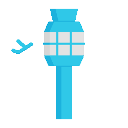
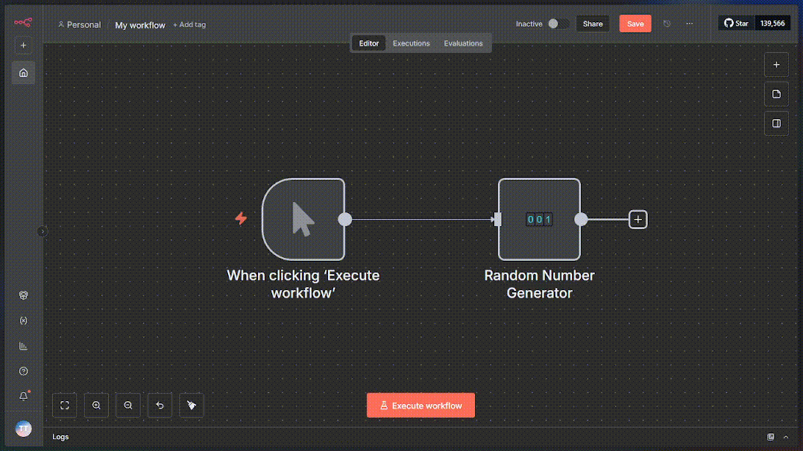
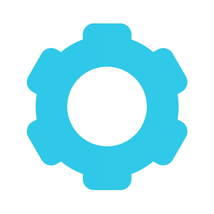
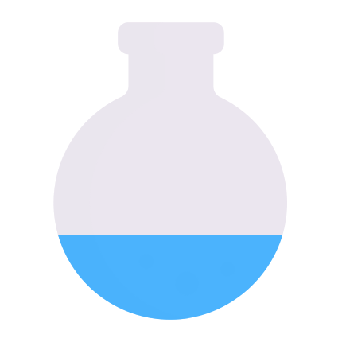

#  Nó Customizado "Random Number" para n8n OnFly 


<p align="center">
  <em>Um conector personalizado para n8n que gera números aleatórios utilizando a API da Random.org (Teste Técnico OnFly)</em>
</p>

<p align="center">
  
</p>

---

#  Índice

<table>
  <tr>
    <td width="30px"></td>
    <td><a href="#-sobre-o-projeto">🎯 Sobre o Projeto</a></td>
  </tr>
  <tr>
    <td></td>
    <td><a href="#-tecnologias-utilizadas">🛠️ Tecnologias Utilizadas</a></td>
  </tr>
  <tr>
    <td></td>
    <td><a href="#-pré-requisitos">📋 Pré-requisitos</a></td>
  </tr>
  <tr>
    <td></td>
    <td><a href="#️-instalação-e-execução">⚙️ Instalação e Execução</a></td>
  </tr>
  <tr>
    <td></td>
    <td><a href="#-como-testar-o-nó">🧪 Como Testar o Nó</a></td>
  </tr>
  <tr>
    <td></td>
    <td><a href="#-estrutura-do-projeto">📁 Estrutura do Projeto</a></td>
  </tr>
  <tr>
    <td></td>
    <td><a href="#-contato">📞 Contato</a></td>
  </tr>
</table>

---

#  Sobre o Projeto

Este projeto foi desenvolvido como parte de um **desafio técnico OnFly**. O objetivo foi criar um conector (nó) personalizado para a plataforma de automação *low-code* **n8n**.

## 🎲 Funcionalidades Principais

O nó **Random** oferece as seguintes funcionalidades:

- ✅ **Geração de números verdadeiramente aleatórios** através da API da [Random.org](https://www.random.org/)
- ✅ **Configuração de intervalo personalizado** com valores mínimo e máximo
- ✅ **Integração nativa com workflows** do n8n
- ✅ **Suporte a entradas dinâmicas** de nós anteriores
- ✅ **Validação de parâmetros** e tratamento de erros
- ✅ **Interface visual** com ícone personalizado


#  Tecnologias Utilizadas

| Tecnologia | Versão | Utilização |
| :--- | :---: | :--- |
|  **TypeScript** | `^5.8.2` | Linguagem principal para o desenvolvimento do nó customizado, garantindo tipagem forte e robustez ao código. |
|  **Node.js** | `>=20.15` | Ambiente de execução (runtime) para o n8n e para o funcionamento do nó customizado. |
|  **Docker** | `Latest` | Orquestração dos containers da aplicação (n8n) e do banco de dados (PostgreSQL) através do Docker Compose. |
|  **PostgreSQL** | `15` | Banco de dados para a instância do n8n, responsável por persistir todos os workflows, credenciais e históricos de execução. |
| **n8n** | `Latest` | Plataforma de automação low-code onde o nó customizado é integrado. |
| **Random.org API** | `v4` | API externa utilizada para gerar números verdadeiramente aleatórios. |

---

#  Pré-requisitos

Antes de começar, você precisará ter as seguintes ferramentas instaladas em sua máquina:

## 🖥️ Requisitos do Sistema

| Ferramenta | Versão Mínima | Link de Download | Verificação |
|------------|---------------|------------------|-------------|
| **Git** | `2.0+` | [Download Git](https://git-scm.com) | `git --version` |
| **Docker** | `20.0+` | [Docker Desktop](https://www.docker.com/products/docker-desktop/) | `docker --version` |
| **Docker Compose** | `2.0+` | *Já incluído no Docker Desktop* | `docker-compose --version` |

## 🔍 Verificação dos Pré-requisitos

Execute os comandos abaixo para verificar se tudo está instalado corretamente:

```bash
# Verificar Git
git --version

# Verificar Docker
docker --version

# Verificar Docker Compose
docker-compose --version

# Verificar se o Docker está rodando
docker info
```

**⚠️ Importante**: Certifique-se de que o Docker Desktop esteja **executando** antes de prosseguir com a instalação.

---

# ️ Instalação e Execução

Siga os passos abaixo **rigorosamente** para executar a aplicação localmente sem problemas.

## 📋 Passo 1: Clone o Repositório

```bash
# Clone o repositório do projeto
git clone https://github.com/CarlosNeimar/OnFly-Test-Custom-N8N.git

# Navegue para o diretório raiz do projeto
cd OnFly-Test-Custom-N8N
```

## 📦 Passo 2: Instale as Dependências do Nó

```bash
# Instale as dependências do Node.js
npm install

# Instale as definições de tipos (importante para evitar erros)
npm install @types/node @types/lodash --save-dev
```

## 🔨 Passo 3: Compile o Projeto TypeScript

```bash
# Limpe compilações anteriores (se existirem)
npm run build

# Verifique se a pasta 'dist' foi criada com sucesso
ls dist/
```

**✅ Resultado esperado**: Uma pasta `dist/` deve ser criada contendo:
```
dist/
└── nodes/
    └── Random/
        ├── Random.node.js
        └── RandomIcon.svg
```

## 🐳 Passo 4: Configuração do Docker

### 4.1 Limpe Containers Anteriores (se existirem)
```bash
# Pare containers em execução (se houver)
docker-compose down

# Remove containers, redes e volumes (limpeza total)
docker-compose down -v --remove-orphans

# Limpe imagens não utilizadas (opcional)
docker system prune -f
```

## 🚀 Passo 5: Inicialização dos Serviços

### 5.1 Subir os Containers
```bash
# Suba os containers em modo detached (segundo plano)
docker-compose up -d
# Aguarde alguns segundos para inicialização completa
```

### 5.2 Verificar Status dos Containers
```bash
# Verifique se os containers estão rodando
docker-compose ps

# Verifique os logs do n8n (importante para debug)
docker-compose logs n8n

# Verifique os logs do PostgreSQL
docker-compose logs postgres
```

**✅ Status esperado**:
```
     Name                   Command               State            Ports
--------------------------------------------------------------------------------
project_n8n_1         tini -- /docker-entrypoint.sh   Up      0.0.0.0:5678->5678/tcp
project_postgres_1     docker-entrypoint.sh postgres   Up      5432/tcp
```

## 🌐 Passo 6: Acesso ao n8n

### 6.1 Acesse a Interface
1. Abra seu navegador web
2. Navegue para: `http://localhost:5678`
3. **Primeira execução**: Crie uma conta de administrador

### 6.2 Verificação do Nó Customizado
1. Clique em **"Add workflow"** para criar um novo fluxo
2. Clique no botão **"+"** para adicionar um nó
3. Na barra de pesquisa, digite **"Random"**
4. **✅ Sucesso**: O nó "Random" deve aparecer na lista

## 🚨 Solução de Problemas 

### Problema: "Cannot connect to Docker daemon"
```bash
# Solução: Inicie o Docker Desktop manualmente
# No Windows: Procure "Docker Desktop" no menu iniciar
# No macOS: Procure Docker na barra de aplicações
# No Linux: sudo systemctl start docker
```

### Problema: "Port 5678 already in use"
```bash
# Solução: Mate o processo que está usando a porta
# Windows:
netstat -ano | findstr :5678
taskkill /PID <PID_NUMBER> /F

# Linux/macOS:
lsof -ti:5678 | xargs kill -9
```

### Problema: Nó "Random" não aparece
```bash
# Verifique se a pasta dist existe
ls dist/

# Recompile o projeto
npm run build

# Reinicie os containers
docker-compose restart n8n
```

### Problema: Erro de conexão com PostgreSQL
```bash
# Verifique os logs do PostgreSQL
docker-compose logs postgres

# Reinicie apenas o PostgreSQL
docker-compose restart postgres

# Aguarde 30 segundos e reinicie o n8n
docker-compose restart n8n
```

<p align="center"> <strong>Pronto! O ambiente n8n está no ar e o nó customizado Random já estará disponível na paleta de nós para ser usado.</strong></p>

---

#  Como Testar o Nó

Para garantir que o nó `Random` está funcionando corretamente, siga este tutorial passo a passo para construir um workflow de teste simples dentro do ambiente n8n.

## 🧪 Teste Básico - Geração Simples

### 1. Crie um Novo Workflow
Na interface do n8n (`http://localhost:5678`), clique em **"Add workflow"** para iniciar um novo fluxo de trabalho em branco.

### 2. Adicione e Configure o Nó "Random"
- Clique no ícone `+` na tela para abrir a paleta de nós
- Procure por **`Random`** e selecione-o para adicionar ao seu fluxo
- No painel de configurações do nó que se abrirá à direita, preencha os parâmetros:
  - **Min**: `10`
  - **Max**: `500`

### 3. Execute o Nó e Verifique a Saída
- Com o nó selecionado, clique no ícone de "play" (**Execute Node**) para testá-lo individualmente
- Após a execução, navegue até a aba **Output** no painel direito
- Você deverá ver o resultado em formato JSON, contendo o número aleatório gerado pela API da Random.org

**✅ Resultado esperado**:
```json
{
  "randomNumber": 247,
  "min": 10,
  "max": 500,
  "timestamp": "2024-XX-XX T XX:XX:XX.XXXZ"
}
```

## 🔄 Teste Avançado - Entradas Dinâmicas

### 1. Adicione um Nó "Set"
- Adicione um nó **Set** antes do nó **Random**
- Configure-o com dois campos:
  - `min` (Number): `50`
  - `max` (Number): `150`

### 2. Conecte os Nós
- Conecte o nó **Set** ao nó **Random** arrastando da saída do Set para a entrada do Random

### 3. Configure Expressões Dinâmicas
Modifique o nó **Random** para usar expressões que leiam os dados do nó anterior:
- **Min**: `{{ $json.min }}`
- **Max**: `{{ $json.max }}`

### 4. Execute o Workflow Completo
- Execute o workflow completo clicando em **"Execute Workflow"**
- O resultado deverá ser um número aleatório entre 50 e 150
- Isso confirma que seu nó se integra perfeitamente a outros nós em um fluxo de trabalho

## ✅ Validações de Teste

Execute múltiplas vezes e verifique:
- [ ] O número gerado está sempre dentro do intervalo especificado
- [ ] Cada execução produz um número diferente (randomização real)
- [ ] O nó aceita entradas dinâmicas de nós anteriores
- [ ] Não há erros nos logs do container n8n

---

#  Estrutura do Projeto

A estrutura de pastas foi organizada da seguinte forma para separar responsabilidades e manter o código limpo e escalável:

```
OnFly-Test-Custom-N8N/
│
├── 📁 assets/                          # Recursos visuais do projeto
│   ├── 📁 gif/                         # Animações GIF para documentação
│   │   ├── Config.gif                  # GIF da configuração
│   │   ├── Contact.gif                 # GIF de contato
│   │   ├── EstruturaPastas.gif         # GIF da estrutura
│   │   ├── indice.gif                  # GIF do índice
│   │   ├── OnFly.gif                   # GIF da OnFly
│   │   ├── PreRequisito.gif            # GIF dos pré-requisitos
│   │   ├── Sobre.gif                   # GIF sobre o projeto
│   │   ├── TechUsada.gif               # GIF das tecnologias
│   │   └── Test.gif                    # GIF dos testes
│   │
│   ├── 📁 icons/                       # Ícones SVG para seções
│   │   ├── contato.svg                 # Ícone de contato
│   │   ├── correto.svg                 # Ícone de sucesso
│   │   ├── dado.svg                    # Ícone principal (dado)
│   │   ├── estruturaPasta.svg          # Ícone de estrutura
│   │   ├── installExec.svg             # Ícone de instalação
│   │   ├── preReq.svg                  # Ícone de pré-requisitos
│   │   ├── sobre.svg                   # Ícone sobre
│   │   ├── tech-usada.svg              # Ícone de tecnologias
│   │   └── teste.svg                   # Ícone de teste
│   │
│   └── 📁 images/                      # Imagens gerais do projeto
│
├── 📁 src/                             # Código-fonte principal
│   └── 📁 nodes/                       # Definições dos nós customizados
│       └── 📁 Random/                  # Nó de números aleatórios
│           ├── Random.node.ts          # Implementação do nó (TypeScript)
│           └── RandomIcon.svg          # Ícone do nó no n8n
│
├── 📁 dist/                            # Código compilado (gerado automaticamente)
│   └── 📁 nodes/                       # Nós compilados para JavaScript
│       └── 📁 Random/
│           ├── Random.node.js          # Nó compilado
│           └── RandomIcon.svg          # Ícone copiado
│
├── 📄 .editorconfig                    # Configurações do editor
├── 📄 .eslintrc.js                     # Configurações do ESLint
├── 📄 .eslintrc.prepublish.js          # ESLint para pré-publicação
├── 📄 .gitignore                       # Arquivos ignorados pelo Git
├── 📄 .npmignore                       # Arquivos ignorados pelo NPM
├── 📄 .prettierrc.js                   # Configurações do Prettier
├── 📄 docker-compose.yml               # Orquestração dos containers
├── 📄 gulpfile.js                      # Automação de tarefas
├── 📄 index.js                         # Ponto de entrada do pacote
├── 📄 package.json                     # Dependências e scripts NPM
├── 📄 package-lock.json                # Lock das dependências
├── 📄 README.md                        # Documentação do projeto
├── 📄 tsconfig.json                    # Configurações TypeScript
└── 📄 tsconfig.tsbuildinfo             # Cache de compilação TS
```

## 🔍 Detalhamento dos Diretórios Principais

### 📁 `src/nodes/Random/`
**Propósito**: Contém o código-fonte do nó customizado
- `Random.node.ts`: Classe principal que implementa a interface `INodeType` do n8n
- `RandomIcon.svg`: Ícone visual que aparece na paleta de nós do n8n

### 📁 `dist/`
**Propósito**: Código TypeScript compilado para JavaScript
- Gerado automaticamente pelo comando `npm run build`
- É este diretório que é mapeado para dentro do container Docker

### 📁 `assets/`
**Propósito**: Recursos visuais e de documentação
- **GIFs**: Animações explicativas para o README
- **Icons**: Ícones SVG para organização visual da documentação
- **Images**: Screenshots e imagens de apoio

### 📄 Arquivos de Configuração

| Arquivo | Finalidade |
|---------|------------|
| `package.json` | Definições do pacote NPM, dependências e scripts |
| `tsconfig.json` | Configurações de compilação TypeScript |
| `docker-compose.yml` | Definição dos containers (n8n + PostgreSQL) |
| `.eslintrc.js` | Regras de qualidade e estilo de código |
| `.prettierrc.js` | Formatação automática de código |

---

#  Contato

Desenvolvido por **Carlos Neimar** como parte do desafio técnico OnFly.

📧 **E-mail**: carlos.areas@sga.pucminas.br  
🐙 **GitHub**: [@CarlosNeimar](https://github.com/CarlosNeimar)  
🔗 **LinkedIn**: [Carlos Neimar](https://linkedin.com/in/carlosneimar)  

---


<p align="center">
  <em>Desenvolvido para o desafio OnFly</em>
</p>
