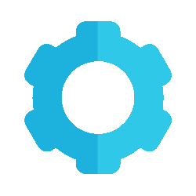

#  Nó Customizado "Random Number" para n8n OnFly 


<p align="center">
  <em>Um conector personalizado para n8n que gera números aleatórios utilizando a API da Random.org. (Teste Onfly)</em>
</p>

<p align="center">
  
</p>

#  Índice

<table>
  <tr>
    <td width="30px"></td>
    <td><a href="#-sobre-o-projeto">Sobre o Projeto</a></td>
  </tr>
  <tr>
    <td></td>
    <td><a href="#-tecnologias-utilizadas">Tecnologias Utilizadas</a></td>
  </tr>
  <tr>
    <td></td>
    <td><a href="#-pré-requisitos">Pré-requisitos</a></td>
  </tr>
  <tr>
    <td></td>
    <td><a href="#️-instalação-e-execução">Instalação e Execução</a></td>
  </tr>
  <tr>
    <td></td>
    <td><a href="#-como-testar-o-nó">Como Testar o Nó</a></td>
  </tr>
  <tr>
    <td></td>
    <td><a href="#-estrutura-do-projeto">Estrutura do Projeto</a></td>
  </tr>
  <tr>
    <td></td>
    <td><a href="#-contato">Contato</a></td>
  </tr>
</table>


#  Sobre o Projeto

Este projeto foi desenvolvido como parte de um desafio técnico OnFly. O objetivo foi criar um conector (nó) personalizado para a plataforma de automação _low-code_ **n8n**.

O nó **Random** se conecta à API pública da [Random.org](https://www.random.org/) para gerar um número inteiro verdadeiramente aleatório a partir de um intervalo definido pelo usuário, com valores de mínimo e máximo inclusos.


#  Tecnologias Utilizadas

| Tecnologia | Utilização |
| :--- | :--- |
|  **TypeScript** | Linguagem principal para o desenvolvimento do nó customizado, garantindo tipagem e robustez ao código. |
|  **Node.js** | Ambiente de execução (runtime) para o n8n e para o funcionamento do nó. |
|  **Docker** | Orquestração dos containers da aplicação (n8n) e do banco de dados (PostgreSQL) através do Docker Compose. |
|  **PostgreSQL** | Banco de dados para a instância do n8n, responsável por persistir todos os workflows, credenciais e históricos de execução. |

#  Pré-requisitos

Antes de começar, você vai precisar ter as seguintes ferramentas instaladas em sua máquina:

- [Git](https://git-scm.com)
- [Docker](https://www.docker.com/products/docker-desktop/)
- [Docker Compose](https://docs.docker.com/compose/install/) (geralmente já vem com o Docker Desktop)


#  Instalação e Execução

Siga os passos abaixo para executar a aplicação localmente.

1.  **Clone o repositório:**
    ```bash
    git clone [https://github.com/CarlosNeimar/OnFly-Test-Custom-N8N.git](https://github.com/CarlosNeimar/OnFly-Test-Custom-N8N.git)
    ```

2.  **Navegue até o diretório do projeto:**

    ```bash
    cd .\OnFly-Test-Custom-N8N\src\DockerRun\    
    ```

3.  **Inicie os containers com Docker Compose:**
    Este comando irá construir e iniciar os containers do n8n e do PostgreSQL em segundo plano (`-d`).

    ```bash
    docker-compose up -d
    ```

4.  **Acesse o n8n:**
    Abra seu navegador e acesse `http://localhost:5678`.

    <p align="center"> Pronto! O ambiente n8n está no ar e o nó customizado Random já estará disponível na paleta de nós para ser usado.</p>


#  Como Testar o Nó

Para garantir que o nó `Random` está funcionando corretamente, siga este tutorial passo a passo para construir um workflow de teste simples dentro do ambiente n8n.

#### 1. Crie um Novo Workflow
Na interface do n8n (`http://localhost:5678`), clique em **"Add workflow"** para iniciar um novo fluxo de trabalho em branco.

#### 2. Adicione e Configure o Nó "Random"
- Clique no ícone `+` na tela para abrir a paleta de nós.
- Procure por **`Random`** e selecione-o para adicionar ao seu fluxo.
- No painel de configurações do nó que se abrirá à direita, preencha os parâmetros:
  - **Min**: `10`
  - **Max**: `500`

<p align="center">
  
  <em>Figura 1: Configuração dos parâmetros do nó.</em>
</p>

#### 3. Execute o Nó e Verifique a Saída
- Com o nó selecionado, clique no ícone de "play" (**Execute Node**) para testá-lo individualmente.
- Após a execução, navegue até a aba **Output** no painel direito. Você deverá ver o resultado em formato JSON, contendo o número aleatório gerado pela API da Random.org.

<p align="center">
  
  <em>Figura 2: JSON de saída com o número aleatório gerado.</em>
</p>

---
### Bônus: Testando com Entradas Dinâmicas

Para simular um cenário real, onde os valores de `min` e `max` vêm de um passo anterior, você pode adicionar um nó **Set** antes do nó **Random**.

1.  **Adicione um nó `Set`** e configure-o com dois campos:
    - `min` (Number): `50`
    - `max` (Number): `150`

2.  **Conecte o nó `Set` ao nó `Random`**.

3.  **Modifique o nó `Random`** para usar expressões que leiam os dados do nó anterior:
    - **Min**: `{{ $json.min }}`
    - **Max**: `{{ $json.max }}`

4.  Execute o workflow completo. O resultado deverá ser um número aleatório entre 50 e 150. Isso confirma que seu nó se integra perfeitamente a outros nós em um fluxo de trabalho.

<p align="center">
  
  <em>Figura 3: Cenário de teste com entradas dinâmicas de um nó anterior.</em>
</p>


#  Estrutura do Projeto

A estrutura de pastas foi organizada da seguinte forma para separar responsabilidades:

#  Contato